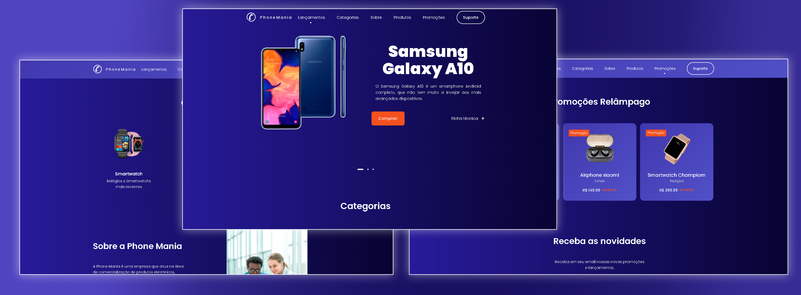

# Website Phone Mania

Projeto desenvolvido assistindo conteúdos no youtube, e adaptado a uma idéia mais consolidada, que é a venda de dispositivos eletronicos.

## Versão WEB
- Para acessar a versão web, clique [aqui](https://guilhermeamarilho.github.io/Phonemania/)

### Tecnologias utilizadas:

- JavaScript 
- Css 3  
- HTML 5
- Frameworks
  - BOXICONS
  - SWIPER
  - SCROLL REVEAL ANIMATION

---

## Apresentação

